# Introdução

Informações básicas do projeto.

* **Projeto:** Sabiaa
* **Repositório GitHub:** https://github.com/ICEI-PUC-Minas-PMGES-TI/pmg-es-2025-2-ti1-2401100-sabia
* **Membros da equipe:**

  * [ALEXIA FERNANDES ALVES DE ANDRADE](https://github.com/aalexiaandrade)
  * [GUSTAVO MARCELO PENIDO PEREIRA](https://github.com/guhpenido)
  * [PERCILIANA ROSA ADALGIZA BATISTA RODRIGUES](https://github.com/thepercilianarodrigues)
  * [RUAN HENRIQUE RODRIGUES DE MORAIS](https://github.com/ruanhmorais)
  * [VICTHOR GUILHERME SANTOS LOIOLA](https://github.com/victhorsn)

A documentação do projeto é estruturada da seguinte forma:

1. Introdução
2. Contexto
3. Product Discovery
4. Product Design
5. Metodologia
6. Solução
7. Referências Bibliográficas

✅ [Documentação de Design Thinking (MIRO)](files/processo-dt.pdf)

# Contexto

A falta de educação básica de qualidade no Brasil é um problema estrutural que compromete diretamente o desenvolvimento social do país. Entre os fatores que agravam esse cenário estão o desvio de verbas públicas, a baixa priorização da educação por parte dos governos, greves constantes de docentes, infraestrutura escolar deficiente, a desmotivação de professores e alunos, além da ausência de formação continuada para os educadores.

Como consequência, muitos estudantes concluem o ensino fundamental sem dominar competências essenciais como leitura, escrita e raciocínio lógico. Essa lacuna no aprendizado contribui para o aumento da evasão escolar, dificuldades no acesso ao ensino superior, baixa qualificação profissional e o aprofundamento das desigualdades sociais.

Diante desse cenário, este projeto propõe o desenvolvimento de um site voltado para a educação básica em escolas públicas brasileiras. O objetivo principal é proporcionar aos alunos um ambiente rico em recursos educativos, que possam complementar para a formação dos alunos.

Nossa plataforma busca incentivar o aprendizado ativo, promover a participação dos estudantes e facilitar o trabalho dos educadores, disponibilizando conteúdos alinhados com as diretrizes curriculares nacionais. Além disso, o site pretende ser uma ferramenta que valorize a diversidade cultural e as realidades regionais do país, contribuindo para a democratização do acesso à educação de qualidade e para a redução das desigualdades no sistema educacional brasileiro.

## Problema

A falta de educação básica de qualidade no Brasil é um problema estrutural que compromete diretamente o desenvolvimento social do país. Entre os fatores que agravam esse cenário estão:

- **Desvio de verbas públicas** destinadas à educação
- **Baixa priorização da educação** por parte dos governos
- **Greves constantes de docentes** que interrompem o calendário letivo  
- **Infraestrutura escolar deficiente** que prejudica o ambiente de aprendizagem
- **Desmotivação de professores e alunos** devido às condições precárias
- **Ausência de formação continuada** para os educadores

### Consequências do Problema

Como resultado desses fatores, observamos graves consequências no sistema educacional brasileiro:

- Muitos estudantes **concluem o ensino fundamental sem dominar competências essenciais** como leitura, escrita e raciocínio lógico
- **Aumento da evasão escolar**, especialmente nas camadas mais vulneráveis da população
- **Dificuldades no acesso ao ensino superior** devido à deficiência na base educacional
- **Baixa qualificação profissional** da força de trabalho
- **Aprofundamento das desigualdades sociais** perpetuando ciclos de pobreza

### Contexto de Aplicação

Este problema afeta diretamente as **escolas públicas brasileiras**, onde estudam aproximadamente 80% dos alunos da educação básica do país. O contexto inclui:

- **Professores** que enfrentam salas superlotadas e falta de recursos didáticos
- **Alunos** de diferentes faixas etárias do ensino fundamental e médio
- **Gestores educacionais** que buscam alternativas para melhorar a qualidade do ensino
- **Comunidade escolar** que precisa de ferramentas complementares ao ensino presencial

A necessidade de **democratização do acesso à educação de qualidade** e a **redução das desigualdades no sistema educacional brasileiro** tornam urgente a busca por soluções inovadoras que possam complementar e enriquecer o processo de ensino-aprendizagem nas escolas públicas.

## Objetivos

### Objetivo Geral

Desenvolver uma aplicação web educacional que modernize o ambiente de ensino-aprendizagem na educação básica pública brasileira, oferecendo uma experiência digital completa, funcional e acessível para os alunos.

### Objetivos Específicos

- **Implementar funcionalidades pedagógicas avançadas** que ampliem as possibilidades de ensino, incluindo:
  - Mecanismos interativos de avaliação de aulas (curtidas)

- **Desenvolver sistema de acompanhamento acadêmico** que permita:
  - Organização estruturada de conteúdos em módulos e listas
  - Aprendizagem adaptável às diferentes rotinas escolares

- **Garantir acessibilidade e usabilidade técnica** através de:
  - Disponibilidade ininterrupta do sistema
  - Desempenho otimizado mesmo sob alta demanda de usuários
  - Compatibilidade com conexões de internet lentas
  - Responsividade para diferentes dispositivos (computadores, tablets, smartphones)

- **Implementar padrões de segurança e acessibilidade digital** que assegurem:
  - Proteção rigorosa de dados sensíveis dos usuários
  - Interface clara e intuitiva para comunicação com o usuário
  - Conformidade com diretrizes de acessibilidade digital

- **Promover uma educação mais inclusiva e tecnologicamente avançada** que contribua para:
  - Redução das desigualdades no acesso à educação de qualidade
  - Fortalecimento do ensino público brasileiro
  - Criação de um ambiente escolar mais justo, colaborativo e preparado para os desafios do século XXI

## Justificativa

### Relevância do Problema

A escolha por desenvolver uma aplicação web educacional para o ensino básico público brasileiro justifica-se pela **urgência e magnitude** do problema educacional no país. Dados do Sistema de Avaliação da Educação Básica (SAEB) de 2021 revelam que apenas **37% dos estudantes** do 5º ano do ensino fundamental possuem níveis adequados de proficiência em matemática, enquanto em língua portuguesa esse percentual chega a **56%**. Esses indicadores demonstram a necessidade crítica de ferramentas complementares que apoiem o processo de ensino-aprendizagem.

### Motivação Tecnológica

A **transformação digital** na educação tornou-se uma necessidade acelerada, especialmente após a pandemia de COVID-19, que evidenciou as limitações do ensino tradicional e a importância de recursos digitais. A implementação de uma plataforma educacional web representa uma oportunidade de:

- **Democratizar o acesso** a recursos educacionais de qualidade
- **Reduzir as desigualdades** entre escolas urbanas e rurais
- **Modernizar as práticas pedagógicas** sem substituir o professor, mas potencializando seu trabalho

### Justificativa dos Objetivos Específicos

#### Funcionalidades Pedagógicas Avançadas
A implementação de sistema de acompanhamento de desempenho justifica-se pela necessidade de **personalização do ensino**. Cada estudante possui ritmo e estilo de aprendizagem únicos, e a tecnologia pode oferecer caminhos diversificados para o conhecimento.

#### Acessibilidade e Compatibilidade Técnica
O foco em dispositivos diversos e conexões lentas é fundamental considerando que **74% dos domicílios brasileiros** acessam a internet exclusivamente pelo celular (IBGE, 2022), e muitas regiões ainda enfrentam limitações de infraestrutura digital.

#### Segurança e Proteção de Dados
A priorização da segurança justifica-se pela **Lei Geral de Proteção de Dados (LGPD)** e pela necessidade de proteger informações sensíveis de menores de idade, garantindo um ambiente digital seguro e confiável.

### Impacto Social Esperado

Este projeto representa mais que uma solução tecnológica - é uma **iniciativa de transformação social**. Ao facilitar o acesso à educação de qualidade, contribui-se para:

- **Quebra de ciclos de pobreza** através da educação
- **Formação de cidadãos** mais preparados para o mercado de trabalho
- **Fortalecimento da democracia** por meio de uma população mais educada e crítica
- **Desenvolvimento econômico** regional e nacional

### Alinhamento com Políticas Públicas

A proposta alinha-se com o **Plano Nacional de Educação (PNE 2014-2024)** e com a **Base Nacional Comum Curricular (BNCC)**, que preconizam o uso de tecnologias digitais como ferramentas pedagógicas essenciais para a educação contemporânea.

A urgência da implementação de soluções inovadoras na educação pública brasileira, combinada com as possibilidades oferecidas pela tecnologia web, torna este projeto não apenas relevante, mas **essencial** para o futuro educacional do país.

## Público-Alvo

O público-alvo desta aplicação web educacional é composto principalmente por **discentes do ensino fundamental** das escolas públicas brasileiras, além de familiares que acompanham o processo de aprendizagem.

### Docentes do Ensino Fundamental

**Perfil dos Professores:**
- **Faixa etária**: 23 a 55 anos
- **Formação**: Pedagogia, Licenciaturas diversas ou formação em Normal Superior
- **Experiência profissional**: Desde professores iniciantes até experientes com mais de 20 anos de carreira
- **Contexto de trabalho**: Escolas públicas municipais e estaduais

**Relação com a Tecnologia:**
- **Conhecimento básico a intermediário** em tecnologias digitais
- Familiaridade com **aplicativos de mensagens** (WhatsApp) e **redes sociais**
- **Experiência variável** com plataformas educacionais digitais
- Necessidade de **capacitação e suporte** para ferramentas mais complexas
- Acesso principal via **smartphones** (78% dos professores)

**Necessidades e Desafios:**
- Salas de aula com **25 a 40 alunos** em média
- Carga horária elevada (**40 horas semanais** ou mais)
- Necessidade de **materiais complementares** para diversificar as aulas
- Dificuldades para **acompanhar individualmente** o progresso dos estudantes
- Carência de **recursos didáticos** adequados e atualizados

### Discentes do Ensino Fundamental

**Perfil dos Estudantes:**
- **Faixa etária**: 6 a 14 anos (1º ao 9º ano)
- **Origem socioeconômica**: Predominantemente classes C, D e E
- **Contexto familiar**: Muitos com pais de baixa escolaridade
- **Localização**: Áreas urbanas periféricas e rurais

**Relação com a Tecnologia:**
- **Nativos digitais** com alta familiaridade com dispositivos móveis
- Uso intenso de **aplicativos de entretenimento** (TikTok, YouTube, jogos)
- **Acesso limitado** a computadores ou tablets
- Conexão à internet predominantemente via **dados móveis**
- **Conhecimento intuitivo** mas superficial das tecnologias

**Características de Aprendizagem:**
- **Atenção fragmentada** devido ao uso intenso de redes sociais
- Preferência por **conteúdos visuais e interativos**
- Necessidade de **feedback imediato** e gamificação
- **Diferentes ritmos** de aprendizagem dentro da mesma turma
- Carência de **acompanhamento familiar** nos estudos

### Público Secundário

**Gestores Educacionais:**
- **Diretores e coordenadores pedagógicos** de escolas públicas
- Necessidade de **relatórios** e **métricas de desempenho**
- Foco em **resultados educacionais** e **cumprimento de metas**

**Familiares/Responsáveis:**
- **Pais e responsáveis** interessados no acompanhamento escolar
- **Conhecimento tecnológico limitado** na maioria dos casos
- Necessidade de **informações simples e claras** sobre o progresso dos filhos

### Características Técnicas do Ambiente

**Infraestrutura Tecnológica:**
- **Conexão de internet instável** ou lenta em muitas regiões
- Predominância de **dispositivos móveis** Android de entrada
- **Laboratórios de informática** com equipamentos defasados
- **Sinal WiFi limitado** nas escolas

**Contexto Socioeconômico:**
- **Limitações orçamentárias** para aquisição de dispositivos
- **Compartilhamento de equipamentos** entre familiares
- **Acesso intermitente** à internet devido a questões financeiras

### Expectativas da Solução

O público-alvo espera uma plataforma que seja:
- **Intuitiva e fácil de usar** mesmo com conhecimento tecnológico limitado
- **Acessível em dispositivos móveis** com boa performance
- **Alinhada com o currículo oficial** (BNCC)
- **Gratuita** e sem necessidade de assinaturas
- **Funcional com conexão lenta** ou intermitente
- **Segura** para menores de idade

# Product Discovery

## Etapa de Entendimento

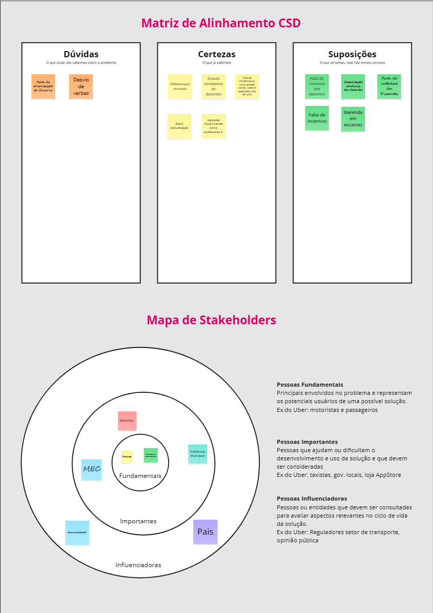
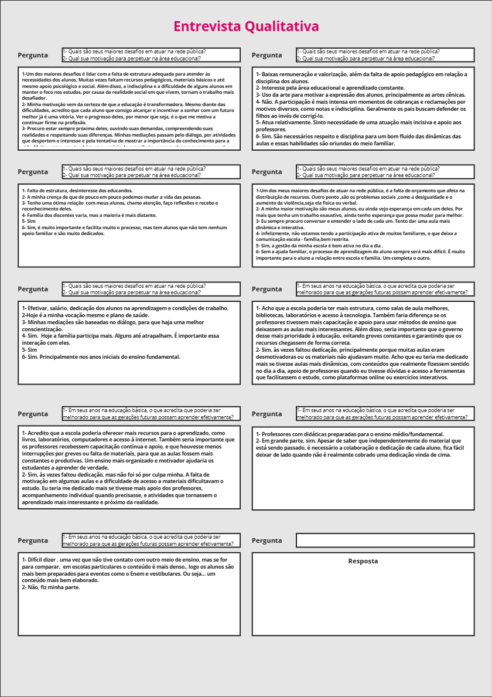
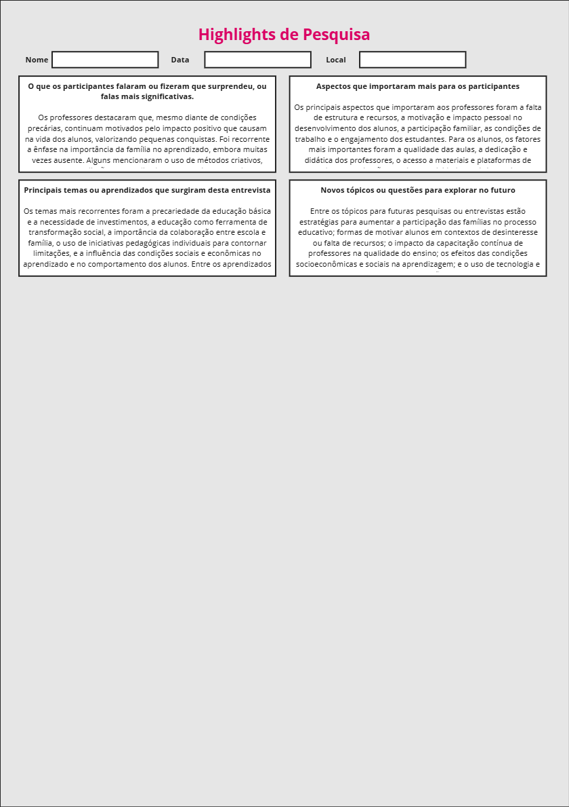

## Etapa de Definição

### Personas

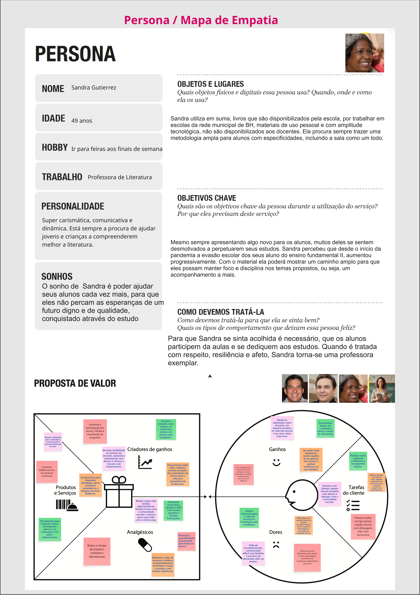

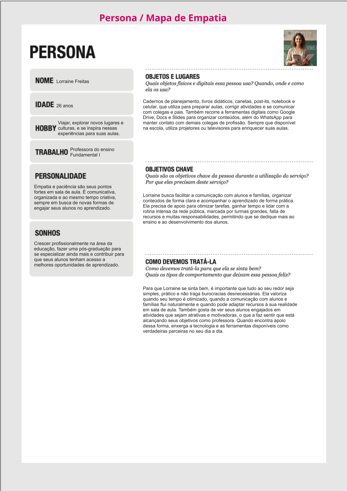

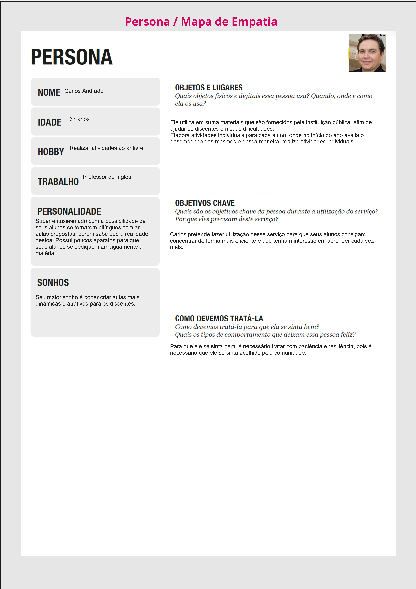

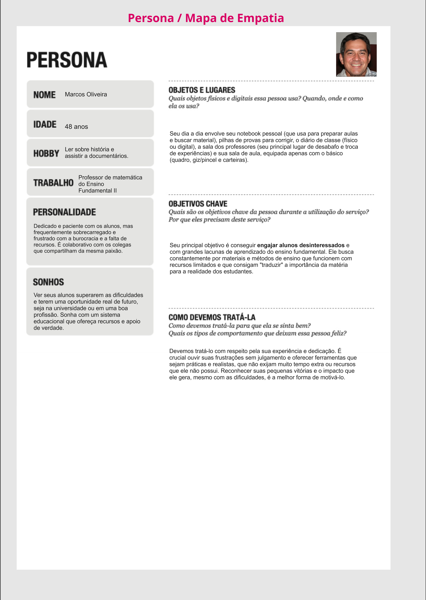

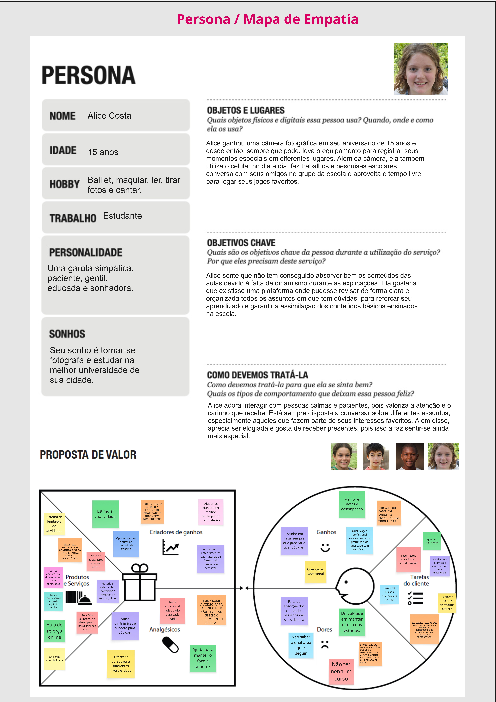

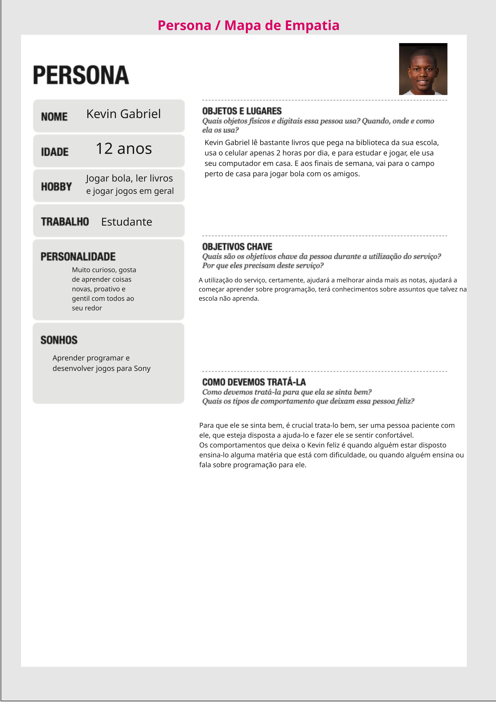

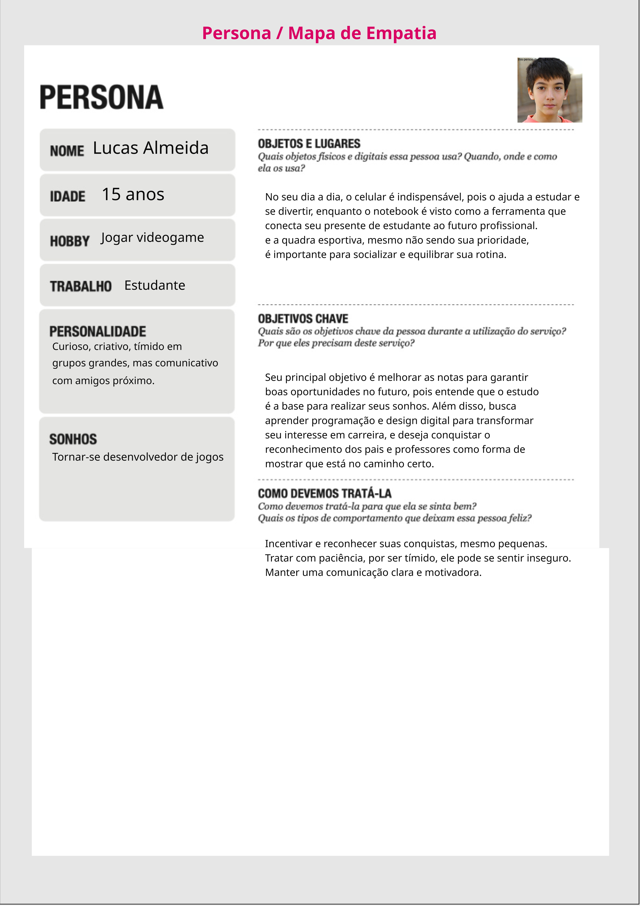

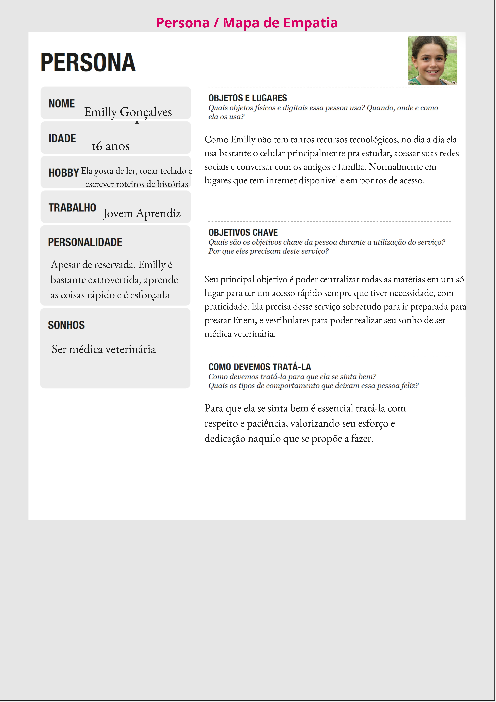

# Product Design

Nesse momento, vamos transformar os insights e validações obtidos em soluções tangíveis e utilizáveis. Essa fase envolve a definição de uma proposta de valor, detalhando a prioridade de cada ideia e a consequente criação de wireframes, mockups e protótipos de alta fidelidade, que detalham a interface e a experiência do usuário.

## Histórias de Usuários

Com base na análise das personas foram identificadas as seguintes histórias de usuários:

### Histórias dos Professores

| EU COMO...`PERSONA` | QUERO/PRECISO ...`FUNCIONALIDADE` | PARA ...`MOTIVO/VALOR` |
| --------------------- | ---------------------------------- | ---------------------- |
| Sandra Gutierrez (Professora de Literatura) | Lançar notas e presença de forma rápida e simples | Otimizar meu tempo e reduzir o uso de papéis |
| Sandra Gutierrez (Professora de Literatura) | Enviar avisos, atividades e materiais extras para toda a turma de uma vez | Superar a escassez de cópias e melhorar o desempenho dos alunos |
| Sandra Gutierrez (Professora de Literatura) | Que o sistema funcione com conexão lenta | Poder trabalhar em diferentes lugares sem limitações de conectividade |
| Sandra Gutierrez (Professora de Literatura) | Espaços específicos para separar os conteúdos por disciplina | Organizar melhor meus materiais didáticos |
| Carlos Andrade (Professor de Inglês) | Enviar atividades durante a semana mesmo não estando em sala | Manter contato constante com os alunos entre as aulas semanais |
| Carlos Andrade (Professor de Inglês) | Ver quem enviou tarefas e acompanhar o desenvolvimento | Planejar melhor as próximas aulas e dar feedback individualizado |
| Carlos Andrade (Professor de Inglês) | Disponibilizar vídeo-aulas com assuntos específicos | Complementar o ensino com a frequência limitada das aulas |
| Carlos Andrade (Professor de Inglês) | Notificações automáticas lembrando dos prazos | Garantir que todos os alunos sejam informados sobre entregas |
| Lorraine Freitas (Professora Ensino Fundamental I) | Otimizar minhas tarefas diárias | Reduzir a exaustão e ter mais tempo para preparar aulas de qualidade |
| Lorraine Freitas (Professora Ensino Fundamental I) | Ter acesso a materiais de apoio digitais | Complementar a escassez de recursos físicos da escola |
| Lorraine Freitas (Professora Ensino Fundamental I) | Trabalhar em um ambiente prático sem burocracias | Focar mais no ensino e menos em processos administrativos |
| Lorraine Freitas (Professora Ensino Fundamental I) | Integrar ferramentas digitais nas aulas | Tornar as aulas mais dinâmicas e interessantes para os alunos |
| Marcos Oliveira (Professor de Matemática) | Engajar meus alunos e reduzir a evasão escolar | Motivar os estudantes a não desistirem de seus objetivos futuros |
| Marcos Oliveira (Professor de Matemática) | Diminuir minhas demandas diárias exaustivas | Manter-me motivado e dedicado ao ensino |
| Marcos Oliveira (Professor de Matemática) | Ter ferramentas para acompanhar o progresso individual dos alunos | Identificar dificuldades e oferecer suporte personalizado |

### Histórias dos Alunos

| EU COMO...`PERSONA` | QUERO/PRECISO ...`FUNCIONALIDADE` | PARA ...`MOTIVO/VALOR` |
| --------------------- | ---------------------------------- | ---------------------- |
| Emilly Gonçalves (Aluna 1º ano EM) | Ter todas as matérias organizadas em um só lugar | Não perder tempo procurando materiais avulsos |
| Emilly Gonçalves (Aluna 1º ano EM) | Acessar vídeo-aulas dos temas que tenho dificuldade | Complementar os conteúdos que não são dados adequadamente na escola |
| Emilly Gonçalves (Aluna 1º ano EM) | Ser avaliada constantemente pelos professores | Acompanhar meu próprio desempenho e melhorar continuamente |
| Emilly Gonçalves (Aluna 1º ano EM) | Baixar materiais para estudar offline | Estudar mesmo sem conexão à internet |
| Emilly Gonçalves (Aluna 1º ano EM) | Ouvir aulas em áudio | Aproveitar o tempo enquanto faço outras tarefas |
| Kevin Gabriel (Aluno 7º ano) | Ter exercícios diários para memorização | Fixar melhor os conteúdos de matemática e ciências |
| Kevin Gabriel (Aluno 7º ano) | Receber orientação permanente dos professores | Ter meus erros apontados e corrigidos rapidamente |
| Kevin Gabriel (Aluno 7º ano) | Acessar explicações em diferentes formatos (textos, vídeos, simulados) | Aprender de forma mais dinâmica e acessível |
| Kevin Gabriel (Aluno 7º ano) | Ter conteúdos de programação disponíveis | Desenvolver meu interesse na área de tecnologia |
| Alice Costa (Aluna 15 anos) | Ter propostas e dinâmicas interessantes | Manter-me motivada e focada nos estudos |
| Alice Costa (Aluna 15 anos) | Usar tecnologias no aprendizado | Aprender de forma mais interessante e real |
| Alice Costa (Aluna 15 anos) | Interagir com outros estudantes na plataforma | Conhecer pessoas novas e me sentir acolhida |
| Alice Costa (Aluna 15 anos) | Ter conteúdos relacionados às artes e cultura | Conectar meus interesses pessoais com o aprendizado |
| Lucas Almeida (Aluno 15 anos) | Ter assuntos mais atrativos nos conteúdos | Reduzir meu desinteresse e procrastinação |
| Lucas Almeida (Aluno 15 anos) | Ser reconhecido e incentivado pelos professores | Manter-me motivado e comunicativo |
| Lucas Almeida (Aluno 15 anos) | Acessar conteúdos sobre programação de jogos | Desenvolver conhecimentos para meu objetivo profissional |
| Lucas Almeida (Aluno 15 anos) | Ter feedback constante do meu progresso | Sentir-me acolhido e acompanhado no aprendizado |

## Proposta de Valor

##### Proposta de valor para as Personas que são professores:

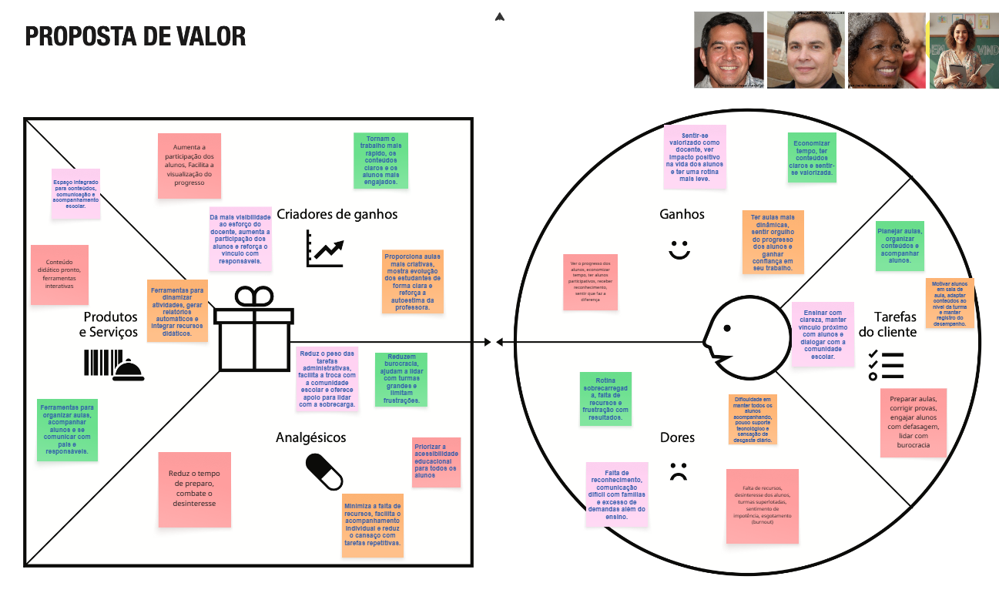

##### Proposta de valor para as Personas que são alunos:

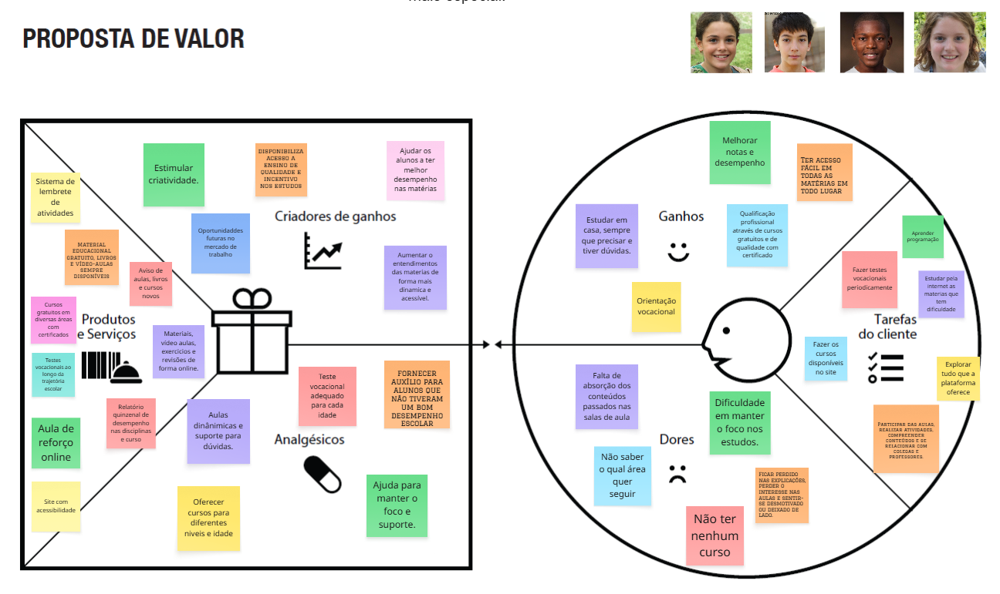

## Requisitos

As tabelas que se seguem apresentam os requisitos funcionais e não funcionais que detalham o escopo do projeto.

### Requisitos Funcionais

| ID     | Descrição do Requisito | Prioridade |
| ------ | ---------------------- | ---------- |
| RF-001 | Alunos e professores podem se cadastrar com e-mail, senha e dados básicos | ALTA |
| RF-002 | Usuários podem fazer login e logout de forma segura | ALTA |
| RF-003 | Usuários podem recuperar a senha pelo e-mail | MÉDIA |
| RF-004 | Professores podem publicar vídeo-aulas com título, descrição e categoria | ALTA |
| RF-005 | Alunos podem assistir às vídeo-aulas pelo site ou aplicativo | ALTA |
| RF-006 | Usuários podem marcar aulas como favoritas para acessar depois | MÉDIA |
| RF-007 | O sistema permite buscar vídeos por matéria, série ou palavra-chave | ALTA |
| RF-008 | Alunos podem fazer quizzes e exercícios relacionados às aulas | ALTA |
| RF-009 | O sistema registra o progresso do aluno em cada curso ou matéria | ALTA |
| RF-010 | O sistema mostra relatórios de desempenho, incluindo acertos, erros e evolução | MÉDIA |
| RF-011 | Alunos podem enviar dúvidas sobre aulas aos professores | MÉDIA |
| RF-012 | Professores podem responder dúvidas enviadas pelos alunos | MÉDIA |
| RF-013 | O sistema envia notificações sobre novas aulas ou respostas a dúvidas | BAIXA |
| RF-014 | Administradores podem gerenciar usuários, conteúdos e categorias | ALTA |
| RF-015 | Administradores podem gerar relatórios sobre alunos cadastrados, aulas assistidas e conteúdos mais acessados | MÉDIA |
| RF-016 | Professores podem adicionar arquivos complementares (PDFs, slides) às aulas | MÉDIA |
| RF-017 | O sistema permite que alunos revisem aulas e exercícios anteriores | MÉDIA |
| RF-018 | Alunos podem avaliar aulas com curtidas ou comentários | BAIXA |
| RF-019 | Professores podem acompanhar o desempenho individual e da turma em quizzes | MÉDIA |
| RF-020 | O sistema permite criar listas ou módulos de aulas para organizar o conteúdo | MÉDIA |

### Requisitos não Funcionais

| ID      | Descrição do Requisito | Prioridade |
| ------- | ---------------------- | ---------- |
| RNF-001 | O sistema deve estar disponível 24 horas por dia, 7 dias por semana | ALTA |
| RNF-002 | As páginas devem carregar em até 3 segundos, mesmo com tráfego alto | ALTA |
| RNF-003 | O site deve funcionar bem em conexões lentas, como 3G | ALTA |
| RNF-004 | O sistema deve suportar aumento de usuários e conteúdos sem perder desempenho | MÉDIA |
| RNF-005 | Layout deve ser responsivo para celulares, tablets e desktops | ALTA |
| RNF-006 | Textos e botões devem ter tamanho e contraste adequados para leitura confortável | MÉDIA |
| RNF-007 | Navegação deve ser simples e intuitiva para crianças e adolescentes | ALTA |
| RNF-008 | Todo conteúdo deve ser compatível com leitores de tela | MÉDIA |
| RNF-009 | Mensagens de erro e alertas devem ser claras e em português | MÉDIA |
| RNF-010 | Senhas e dados sensíveis devem ser criptografados | ALTA |
| RNF-011 | Apenas usuários autenticados podem enviar exercícios, comentários ou respostas | ALTA |
| RNF-012 | Logs de erros e acessos devem ser armazenados para monitoramento e auditoria | MÉDIA |
| RNF-013 | Atualizações devem ser aplicadas sem interromper o serviço | MÉDIA |
| RNF-014 | O código deve ser versionado e documentado para facilitar a manutenção futura | BAIXA |
| RNF-015 | Curtidas, comentários e interações devem ser processadas sem atrasos | MÉDIA |
| RNF-016 | Vídeos e quizzes devem ser carregados sem travamentos | ALTA |

## Projeto de Interface

Artefatos relacionados com a interface e a interacão do usuário na proposta de solução.

### Telas

Estes são os protótipos de telas do sistema.

**✳️✳️✳️ COLOQUE AQUI OS PROTÓTIPOS DE TELAS COM TÍTULO E DESCRIÇÃO ✳️✳️✳️**

##### TELA HOME

A página inicial da Sabiaa é projetada para ser um ponto de entrada claro e informativo, comunicando imediatamente que somos uma plataforma educacional que oferece conteúdos digitais de qualidade para as escolas. A tela se organiza em três blocos principais: um Banner Principal que destaca nossa missão e convida à exploração de conteúdos; uma seção de Benefícios que detalha nossos diferenciais (Materiais Interativos, Apoio a Professores e Atividades Práticas); e uma vitrine de Cursos Populares (Matemática, Português e Ciências). A navegação é garantida pelo cabeçalho (com opções para Entrar e Cadastrar) e pelo rodapé, que fornece informações de contato e links essenciais.

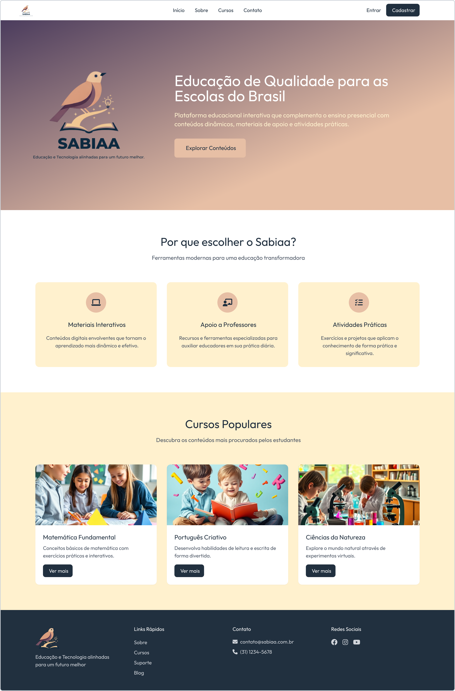

##### TELA LOGIN

Esta é a tela de Login da plataforma Sabiaa, caracterizada por um design focado na autenticação do usuário, com um fundo de cor roxa escura contrastando com uma caixa central bege claro onde se localiza o formulário. O topo e o rodapé da tela mantêm a identidade visual da plataforma, exibindo o logo, as opções de navegação e as informações de contato. O formulário de acesso é simples e direto, solicitando apenas o E-MAIL e a SENHA, e inclui um botão "LOGIN" e um link para "Recuperar Senha".

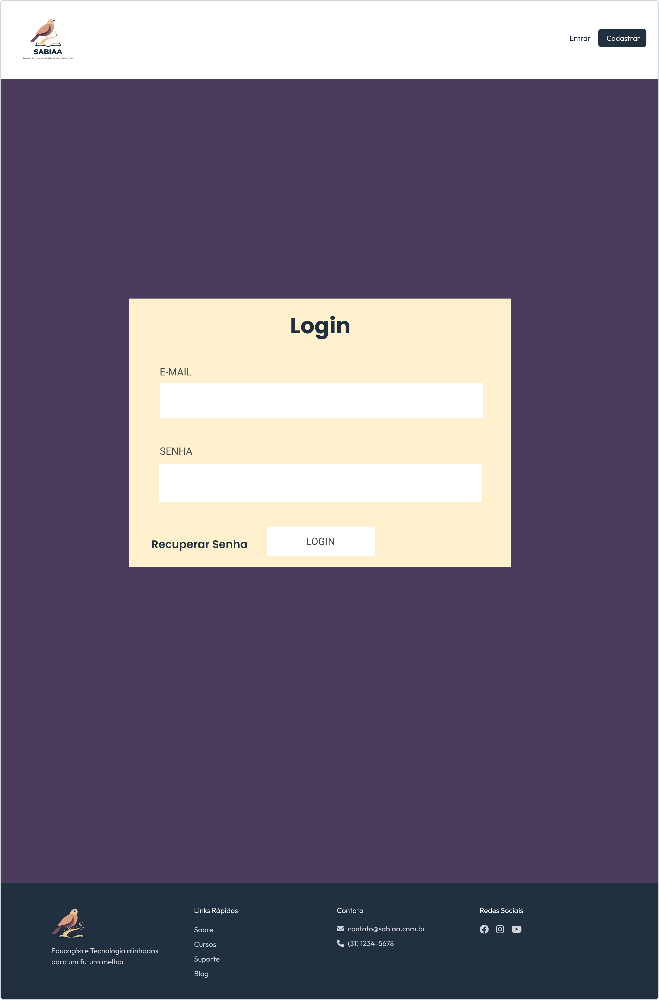

##### TELA CADASTRO

Esta é a tela de Cadastro (ou registro) da plataforma Sabiaa, mantendo o padrão visual da tela de Login com um fundo roxo escuro e o formulário centralizado em uma caixa bege claro, enquanto o cabeçalho e o rodapé permanecem consistentes com o resto do site. A página é introduzida pelo título "Novo por aqui? Cadastra-se abaixo" e solicita dados essenciais como Nome, Sobrenome, Telefone e E-MAIL. A segurança é enfatizada com os campos de Senha e Confirmar senha (com requisito de mínimo 8 caracteres), e o formulário é finalizado com a obrigatória concordância aos Termos de uso e Política de Privacidade antes de o usuário clicar no botão "CADASTRAR-SE".

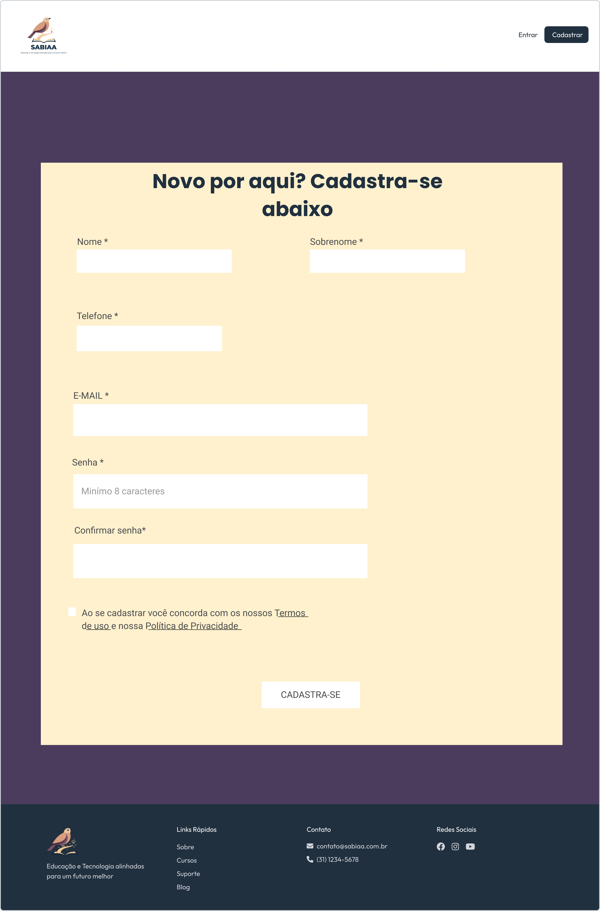

##### TELA PERFIL

Esta é a tela de Perfil da plataforma Sabiaa, seguindo o mesmo padrão visual com um fundo roxo escuro e uma área central bege para o conteúdo. A página é claramente identificada pelo título "Perfil" e por um ícone de usuário no topo, com uma seta de retorno (←) indicando a possibilidade de voltar à página anterior. O formulário apresenta os campos de informação do usuário para visualização e edição, incluindo Nome, Sobrenome, Telefone e E-MAIL, além dos campos de segurança para alteração de Senha e Confirmar senha (com a indicação de no mínimo 8 dígitos). O cabeçalho e o rodapé mantêm-se consistentes com a identidade do site.

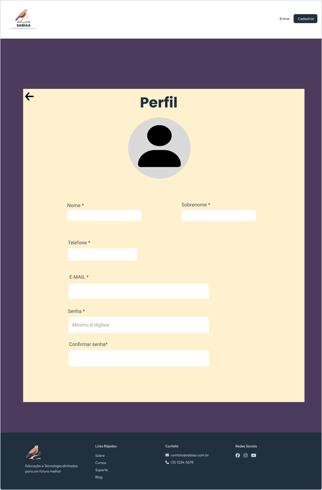

##### TELA RELATÓRO ALUNO, PELO ALUNO

Esta tela representa o Relatório Completo de um aluno na plataforma Sabiaa, com um layout de painel escuro e caixas de informação claras. A interface superior contém a navegação do usuário (Início, Disciplinas, Cursos, Meu Progresso, Perfil), enquanto a área central é dedicada aos dados de desempenho, iniciada pelo título "Seu relatório". O conteúdo é dividido em blocos visuais, apresentando a Evolução Mensal em um gráfico de linha, um resumo de Cursos Concluídos (12) e Horas Estudadas (55h), e gráficos de pizza que detalham o Percentual de Acertos (35 de 60 questões) e o Percentual de Erros (25 de 60 questões). Por fim, há uma seção de Evolução que mostra o progresso em cursos específicos como Português, Matemática, Excel Básico e Introdução ao Javascript Moderno, permitindo ao aluno visualizar seu desempenho e identificar áreas de foco.

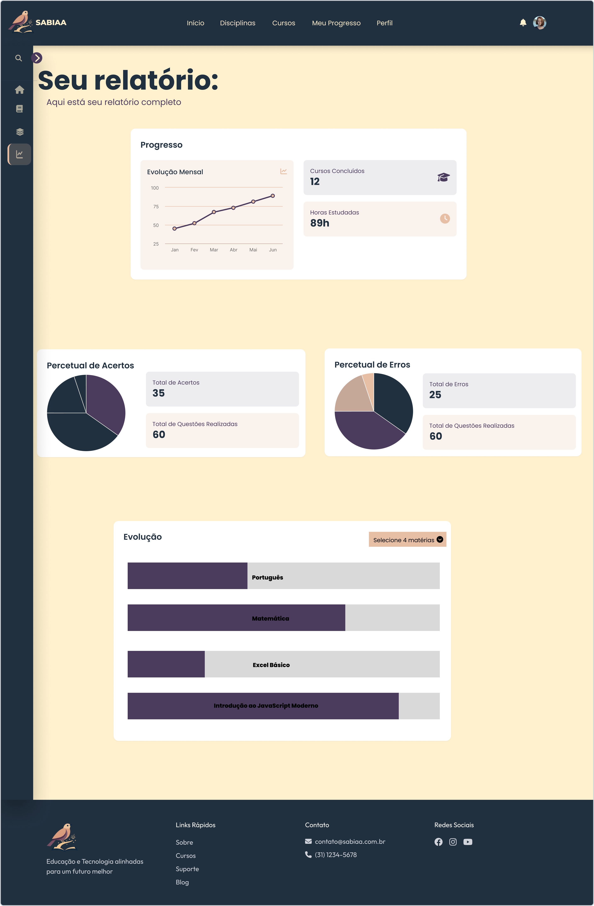

##### TELA RELATÓRO ALUNO, PELO PROFESSOR

Esta tela exibe o Relatório de Maria, um painel de desempenho do aluno visualizado pelo professor na plataforma Sabiaa, com um layout idêntico à versão do estudante, mas com uma seção adicional de comunicação. O relatório é aberto com o título "Relatório de Maria" e mantém os mesmos blocos de dados: o gráfico de Evolução Mensal, o resumo de Cursos Concluídos (12) e Horas Estudadas (55h), e os gráficos de pizza que mostram o Percentual de Acertos e Erros (com base em 60 questões). A seção Evolução detalha o progresso de Maria em disciplinas específicas. A diferença principal é a presença de uma caixa de texto na parte inferior, sob o título "Mensagem", que permite ao professor "Enviar mensagem ao aluno", facilitando a comunicação e o feedback direto sobre o desempenho.

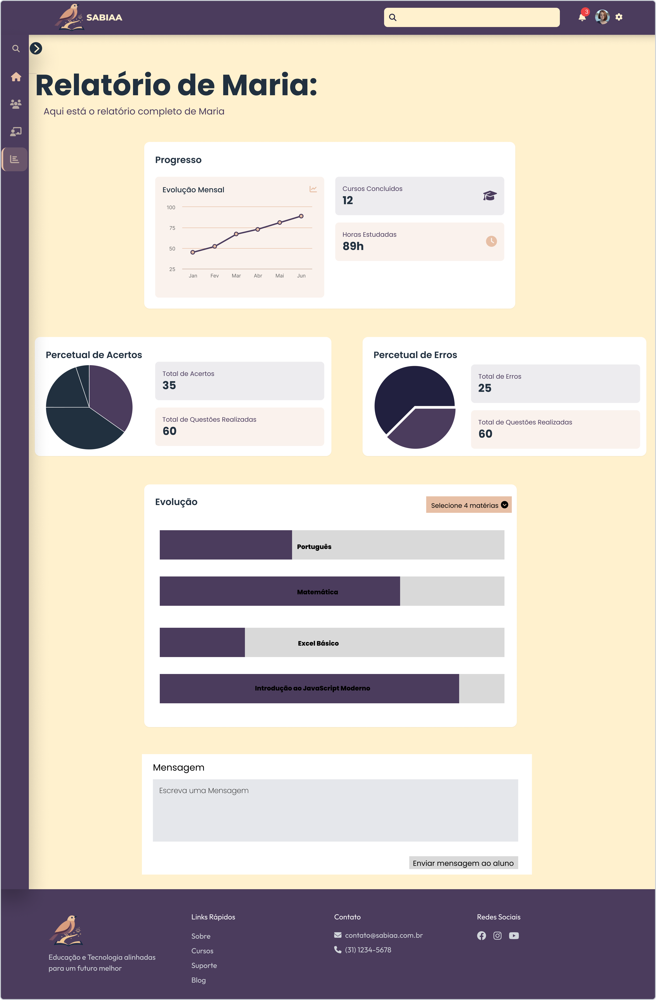

##### TELA DE RECUPERAÇÃO DE SENHA

Esta tela é dedicada ao processo de Recuperação de Senha da plataforma Sabiaa, utilizando o design consistente de caixa de conteúdo bege claro sobre um fundo igualmente bege claro, com o cabeçalho e rodapé escuros. O formulário é centralizado e minimalista, exibindo o logo do pássaro e um ícone de chave, seguido pelo título "Recuperar Senha" e a instrução clara: "Digite seu e-mail para receber as instruções de recuperação". O único campo de entrada é o E-mail, e o usuário interage através do botão primário "Enviar Instruções" ou do link secundário "Voltar ao Login" para retornar à tela de acesso.

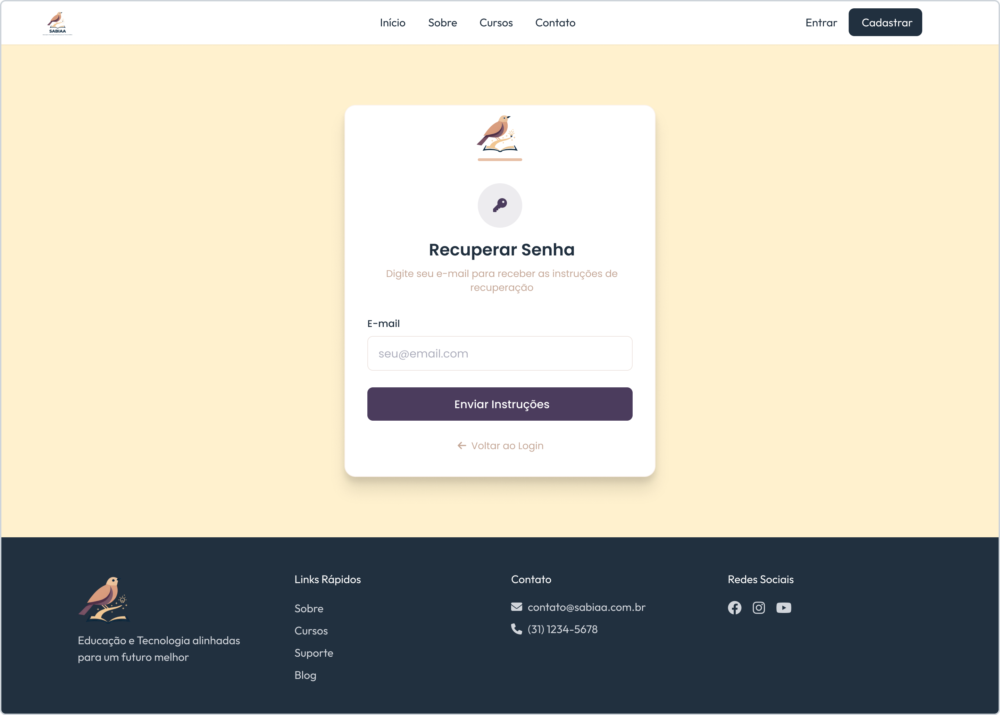

##### TELA DE NOVA SENHA

Esta tela é a interface para Criação de Nova Senha da plataforma Sabiaa, seguindo o padrão visual com uma caixa central bege sobre o fundo suave. A página é focada em segurança, com o título "Nova Senha" e a instrução para criar uma senha segura. O formulário exige que o usuário preencha e confirme a Nova Senha em dois campos separados. Abaixo dos campos, há um box de Validação de Requisitos que orienta o usuário sobre as regras de segurança, indicando com marcas de "x" (vermelhas) ou "tick" (amarelas) se a senha deve conter pelo menos 8 caracteres, uma letra maiúscula, um número e um caractere especial. O processo é concluído com o botão de ação "Redefinir Senha".

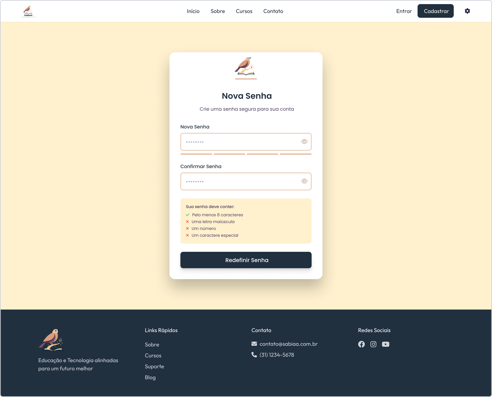

##### TELA INTERNA DE DISCIPLINAS ALUNO

Esta tela é o painel de Disciplinas para os alunos da plataforma Sabiaa, apresentando um design interno limpo com navegação lateral escura (contendo ícones de lupa, casa, relatório, etc.) e a área principal clara. A página é introduzida pelo título "Disciplinas" e a instrução "Escolha uma matéria para começar seus estudos". No topo, há uma barra de pesquisa ("Buscar disciplina...") e dois filtros suspensos: "Todas as séries" e "Todas as áreas". O restante da tela é dominado por oito cartões (cards) que representam as disciplinas disponíveis, cada um com um ícone, título (ex: Português, Matemática, Ciências, História, Geografia, Inglês, Artes, Educação Física), uma breve descrição do conteúdo e o botão "Acessar" para iniciar os estudos. O rodapé mantém as informações de contato e links rápidos usuais.

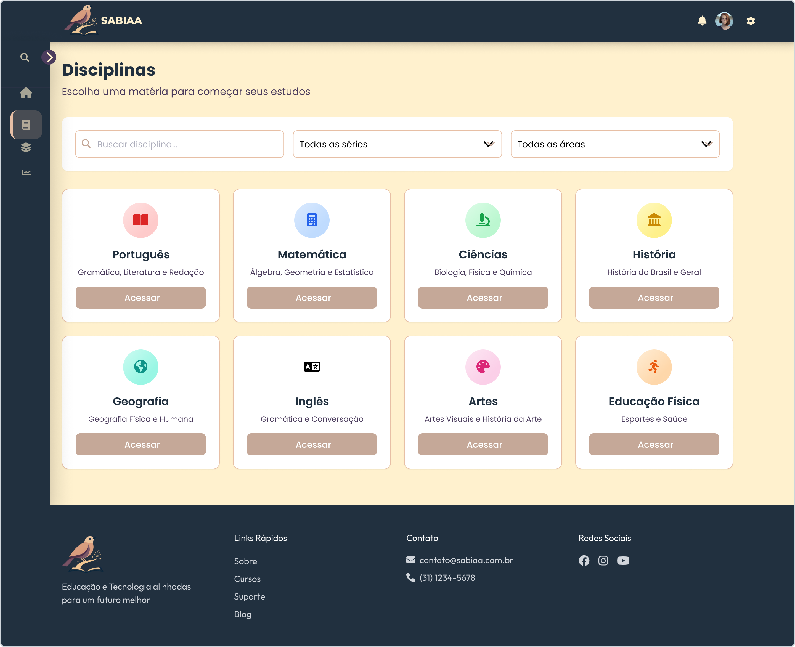

##### TELA INTERNA DE CURSOS ALUNO

Esta tela é o painel de Disciplinas para os alunos da plataforma Sabiaa, apresentando um design interno limpo com navegação lateral escura (contendo ícones de lupa, casa, relatório, etc.) e a área principal clara. A página é introduzida pelo título "Disciplinas" e a instrução "Escolha uma matéria para começar seus estudos". No topo, há uma barra de pesquisa ("Buscar disciplina...") e dois filtros suspensos: "Todas as séries" e "Todas as áreas". O restante da tela é dominado por oito cartões (cards) que representam as disciplinas disponíveis, cada um com um ícone, título (ex: Português, Matemática, Ciências, História, Geografia, Inglês, Artes, Educação Física), uma breve descrição do conteúdo e o botão "Acessar" para iniciar os estudos. O rodapé mantém as informações de contato e links rápidos usuais.

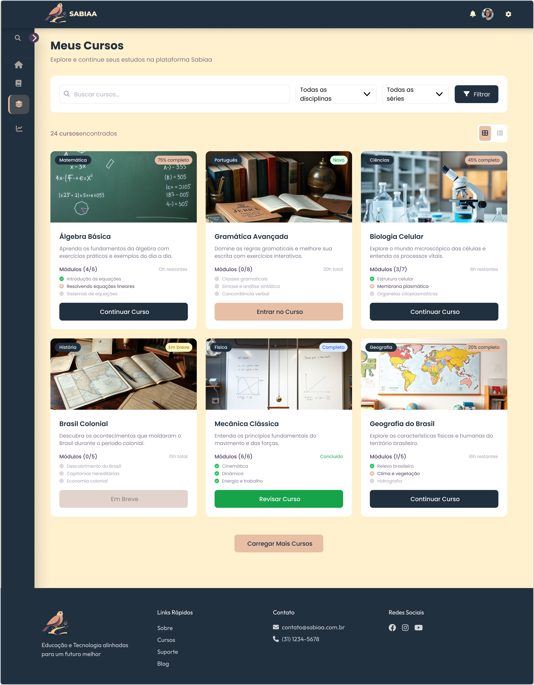

##### TELA INTERNA DE VISUALIZAÇÃO DE CURSO ALUNO

Esta é a tela de visualização de conteúdo dentro de um curso da plataforma Sabiaa, com um layout organizado para o consumo de mídia e materiais complementares. O elemento central é o player de vídeo com seus controles de reprodução. Abaixo do player, são apresentadas informações contextuais da aula (duração, visualizações, data) e a Descrição do conteúdo, seguida da seção "Materiais de Apoio" que oferece arquivos para download. No lado direito, a interface inclui uma barra lateral com a lista de "Vídeos Relacionados" para navegação sequencial no curso, e um painel de "Progresso do Curso" que informa o avanço geral do aluno. A tela mantém a navegação lateral e o rodapé padrão da plataforma.

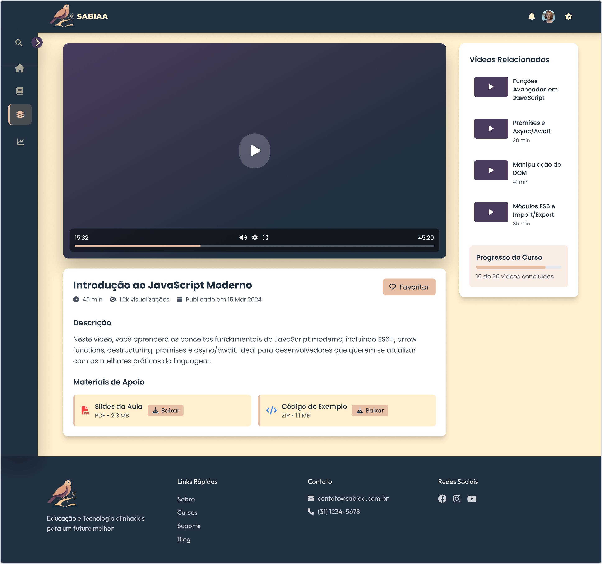

##### TELA INICIAL/DASHBOARD DOS ALUNOS

Esta é a Dashboard (painel inicial) de um aluno da plataforma Sabiaa após o login, projetada para fornecer uma visão geral do engajamento e progresso, com uma saudação personalizada no topo. A tela é organizada em blocos de informações cruciais: o Resumo do Progresso, que combina um gráfico de Evolução Mensal com métricas de Cursos Concluídos e Horas Estudadas; a seção Minhas Tarefas, que lista atividades pendentes, em andamento e concluídas; e, no painel lateral, caixas de Favoritos e Recomendações de novos conteúdos. A funcionalidade é completada pela seção Continuar Assistindo, que permite ao aluno retomar rapidamente a última aula acessada, indicando a porcentagem de progresso. A interface utiliza a navegação lateral e o rodapé padrão da plataforma.

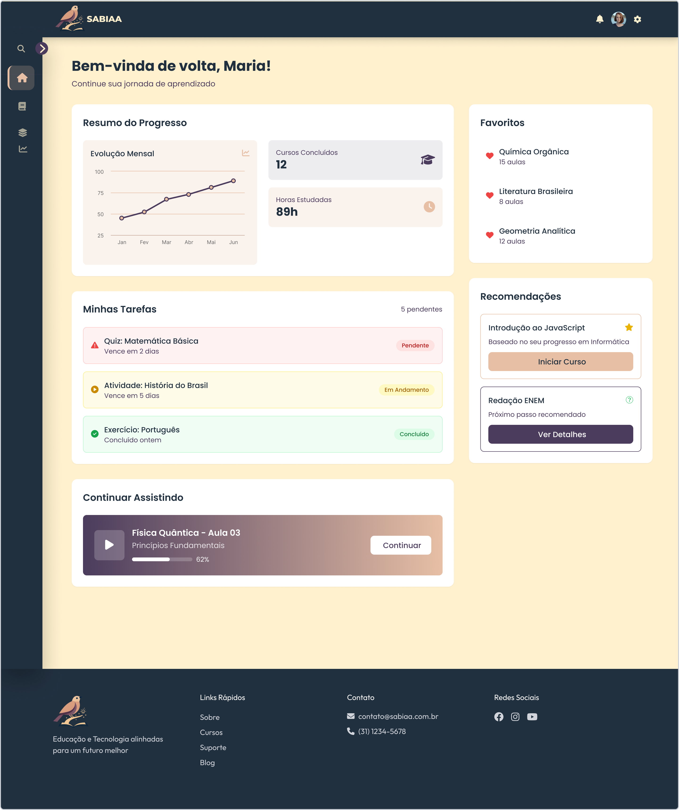

##### TELA INICIAL/DASHBOARD DOS PROFESSORES

Esta é a Dashboard (painel inicial) de um professor da plataforma Sabiaa após o login, projetada para fornecer uma visão gerencial e de tarefas. A tela saúda o usuário, "Bom dia, Prof. João!", e apresenta o resumo das suas turmas. O Resumo das Turmas exibe métricas de alto nível (Desempenho Médio, Taxa de Conclusão, Engajamento), acompanhado por um gráfico de linha que traça a evolução do desempenho de diferentes turmas (Turma A, Turma B, Turma C) ao longo da semana. A seção Minhas Tarefas lista as prioridades, como Corrigir Quizzes (Urgente), Responder Dúvidas (Hoje) e Revisar Atividades (Esta semana). O painel lateral Ações Rápidas oferece atalhos para tarefas comuns (Publicar Vídeo, Material Complementar, Nova Atividade). A área Alertas notifica o professor sobre Alunos com Dificuldades e Atividades Atrasadas. Por fim, a seção Últimas Interações mostra uma linha do tempo de Comentários Recentes, Curtidas e Perguntas dos alunos, facilitando o acompanhamento da atividade.

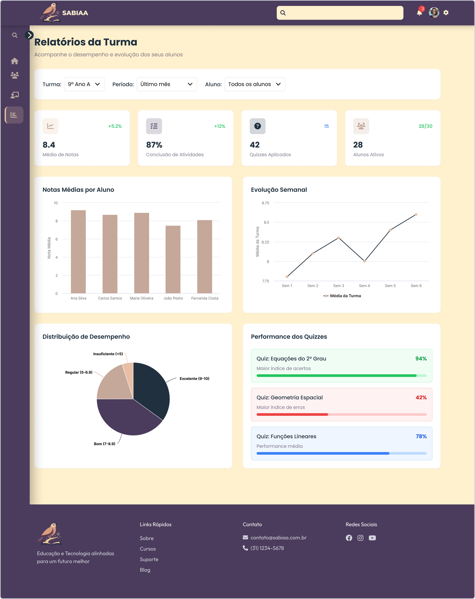

##### TELA DAS TURMAS DOS PROFESSORES

Esta tela é o painel de Gerenciamento de Turmas para os professores na plataforma Sabiaa, com um design interno claro e navegação lateral escura, focado na organização e acompanhamento do progresso dos alunos. O topo é dominado pelo título "Gerenciamento de Turmas" e o botão de ação "+ Nova Turma". A interface de busca inclui Filtros por "Todas as turmas" e "Todos os anos", e um campo para "Buscar turma...". Abaixo, a seção exibe cards de resumo para as turmas ativas do professor, como "Matemática 9º A" e "Matemática 8º B" (ambas Ativa), e "Matemática 7º C" (Pendente), mostrando o número de alunos, a última atividade e a Média geral de cada uma, com um botão "Ver Detalhes". A parte inferior da tela apresenta a Lista de Alunos de uma turma selecionada (ex: "Alunos - Matemática 9º A"), com botões para Exportar e Adicionar Aluno, exibindo em uma tabela o nome do aluno, Status (Ativo/Inativo), Última Atividade, Média e Ações de gerenciamento.

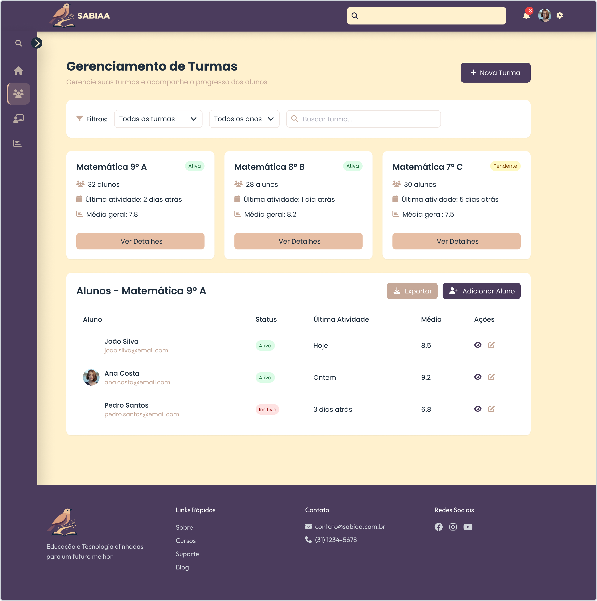

##### TELA DAS AULAS DOS PROFESSORES

Esta tela é o painel de Gerenciamento de Aulas para professores na plataforma Sabiaa, dividido em duas colunas funcionais. No lado esquerdo, encontra-se o formulário "Nova Aula", que permite ao professor cadastrar um novo conteúdo, solicitando o Título da Aula e sua Descrição, a Turma e o Módulo de destino (via dropdown), o Upload de Vídeo (com limites de formato e tamanho) e a adição de Arquivos Complementares. Este formulário oferece as ações "Salvar Rascunho" e "Publicar Aula". A coluna da direita exibe "Minhas Aulas" em formato de grade, com opções de visualização (lista/cartões) e filtro no topo. Cada cartão de aula (exibindo status como Publicado ou Rascunho) inclui um thumbnail com play button, título, data e ações rápidas como Visualizar, Editar e Excluir. A interface mantém a navegação lateral e o rodapé padrão da plataforma.

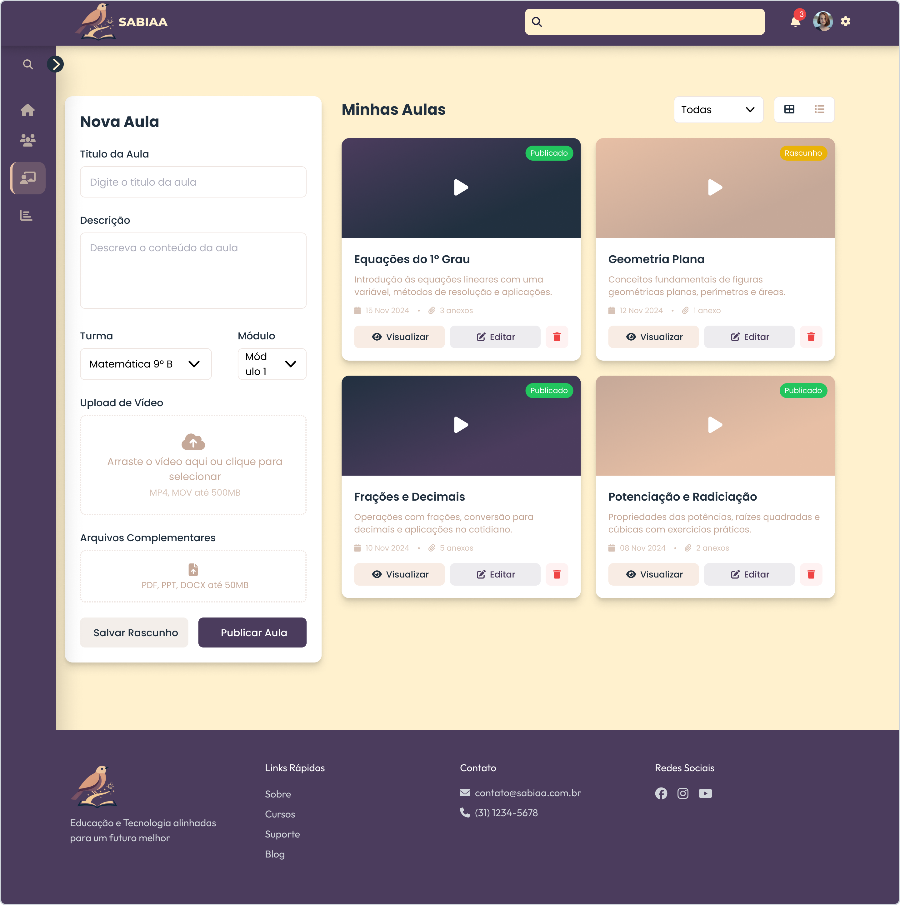

##### TELA DE RELATORIO DA TURMA, PELOS PROFESSORES

Esta é a tela de Relatórios da Turma na plataforma Sabiaa, um painel analítico para o professor acompanhar o desempenho e a evolução dos alunos. O topo da tela possui filtros essenciais para personalizar os dados exibidos: Turma, Período e Aluno. O conteúdo é estruturado em blocos de dashboards: a seção superior exibe cartões de Métricas Gerais com indicadores como Média de Notas, Conclusão de Atividades, Quizzes Aplicados e Alunos Ativos, incluindo a variação percentual de progresso. Abaixo, são apresentados gráficos detalhados, como as Notas Médias por Aluno (em barras) e a Evolução Semanal da média da turma (em linha). A parte inferior contém gráficos de análise aprofundada, com a Distribuição de Desempenho dos alunos em um gráfico de pizza categorizado por faixas de notas, e o Performance dos Quizzes em barras de progresso, destacando o índice de acertos ou erros em atividades específicas.

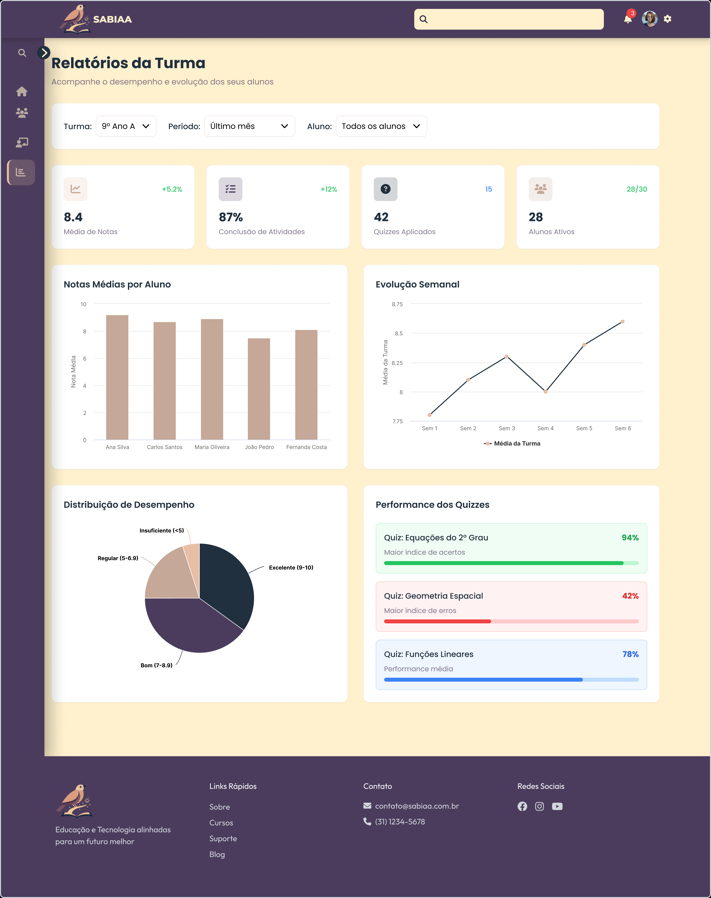

##### TELA DE CADASTRO DE NOVA ATIVIDADE

Esta é a tela "Cadastrar Nova Atividade" da plataforma Sabiaa, uma interface interna para o professor criar e gerenciar tarefas para seus alunos. A tela é dividida em duas colunas principais: o formulário de cadastro no centro e um painel de atividades recentes à direita. O formulário Informações da Atividade permite ao professor selecionar a Turma e inserir o Título e a Descrição Detalhada da tarefa. Ele também exige a seleção do Tipo de Atividade, o Prazo de Entrega e a inclusão de Anexos (por drag-and-drop ou clique), finalizando com as opções "Salvar Rascunho" e "Publicar Atividade". Abaixo, há uma seção de Assistente Sabiaa (IA), onde o professor pode digitar um tema e gerar sugestões personalizadas de atividades. No lado direito, o painel Atividades Recentes lista tarefas criadas anteriormente com seu título, prazo e status (Concluído, Pendente ou Em Andamento). A interface mantém a navegação lateral e o rodapé padrão da plataforma.

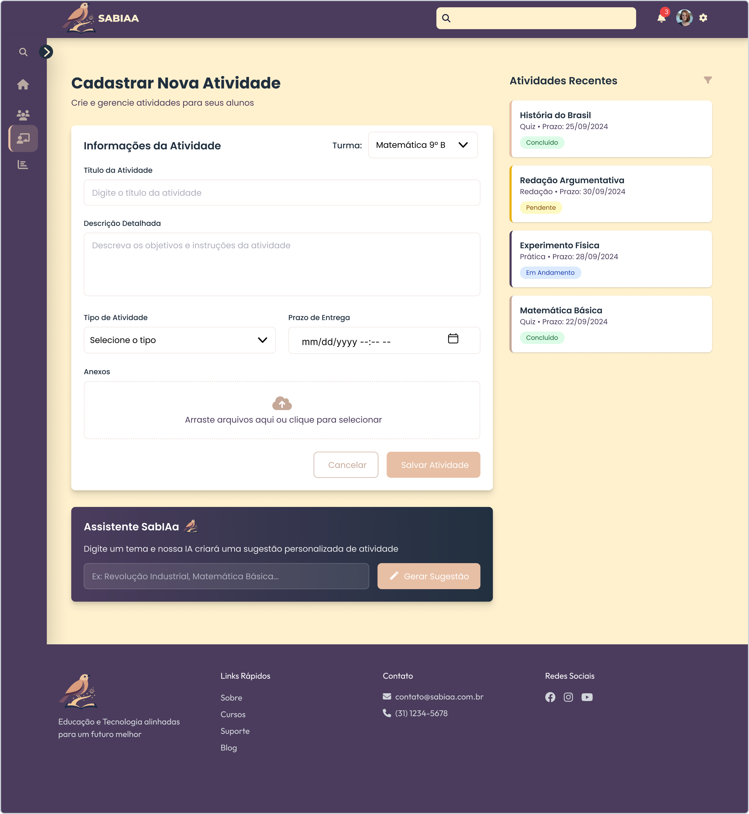

### User Flow

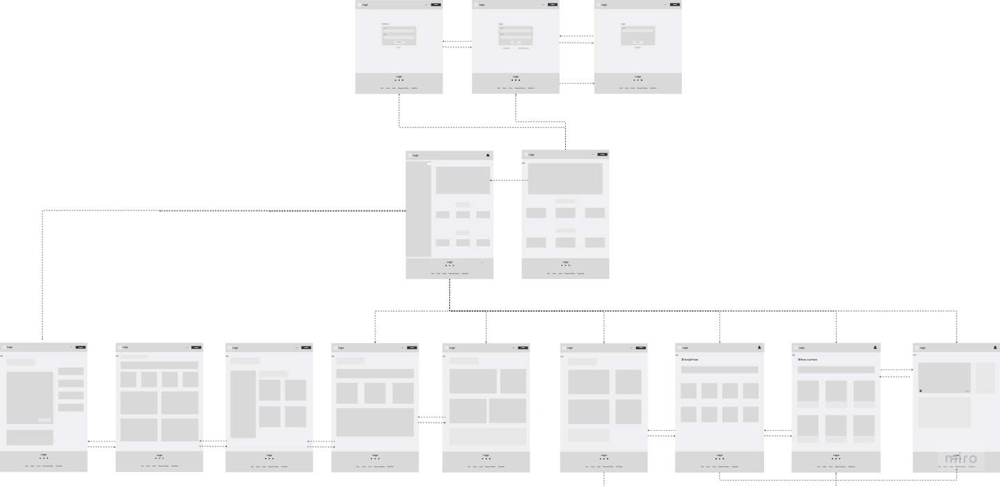
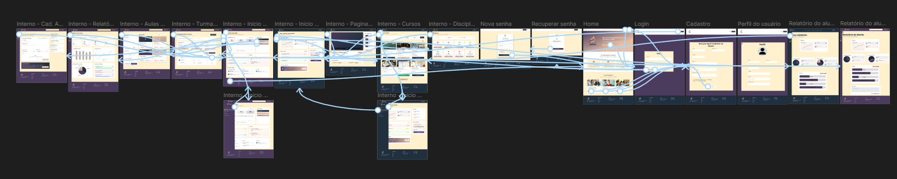

### Protótipo Interativo

✅ [Protótipo Interativo (Figma)](https://www.figma.com/design/pO7ZIDrcam9i4Aq8PRoESj/Sabiaa?node-id=34-23&t=IRYea0boBhI1vwQL-1)

[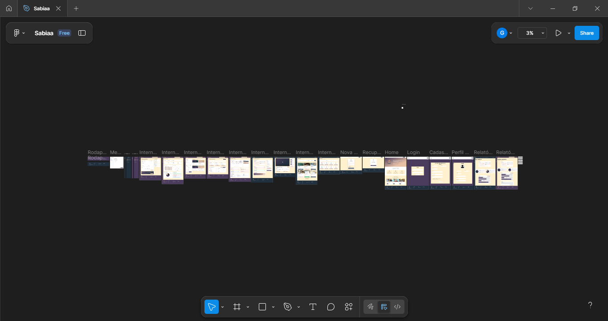](https://www.figma.com/design/pO7ZIDrcam9i4Aq8PRoESj/Sabiaa?node-id=34-23&t=IRYea0boBhI1vwQL-1)
# Metodologia

Detalhes sobre a organização do grupo e o ferramental empregado.

## Ferramentas

Relação de ferramentas empregadas pelo grupo durante o projeto.

| Ambiente                    | Plataforma | Link de acesso                                     |
| --------------------------- | ---------- | -------------------------------------------------- |
| Processo de Design Thinking | Miro       | https://miro.com/app/board/uXjVJSvRFvQ=/|
| Repositório de código     | GitHub     | https://github.com/ICEI-PUC-Minas-PMGES-TI/pmg-es-2025-2-ti1-2401100-sabia|
| Hospedagem do site (HTML, CSS, JS)        | Vercel ou GitHub Pages     | N/A |
| Hospedagem do JSONServer       | Render ou Replit     | N/A |
| Protótipo Interativo       | Figma  | https://www.figma.com/design/pO7ZIDrcam9i4Aq8PRoESj/Sabiaa?node-id=34-23&t=IRYea0boBhI1vwQL-1|
| Gerenciamento de Scrum                    | Jira        | https://sabiaa.atlassian.net/jira/software/projects/SCRUM/boards/1/backlog?atlOrigin=eyJpIjoiN2Y5ODk3Nzk5NTBiNDE5NTg3YzZjNTk0OWE0NjE3NjUiLCJwIjoiaiJ9 |
| Editor de código  | Visual Studio Code | N/A |

## Gerenciamento do Projeto

Divisão de papéis no grupo e apresentação da estrutura da ferramenta de controle de tarefas (Kanban).

### Divisão de Papéis

A equipe adotou a metodologia ágil Scrum para o desenvolvimento do projeto, com a seguinte estrutura organizacional:

#### Papéis Definidos

**Product Owner (P.O): Alexia Fernandes Alves de Andrade**
- Responsável por definir e priorizar o backlog do produto
- Representa os interesses dos usuários finais (professores e alunos)
- Valida se as funcionalidades implementadas atendem aos requisitos
- Aprova as tarefas concluídas antes da integração ao branch principal
- Participa ativamente da equipe de desenvolvimento

**Scrum Master: Gustavo Marcelo Penido Pereira**
- Facilita o processo Scrum e remove impedimentos
- Garante que a equipe siga as práticas ágeis estabelecidas
- Coordena as reuniões de planejamento e retrospectivas
- Monitora o progresso das tarefas no Kanban
- Responsável pela manutenção da qualidade do código no branch principal
- Participa ativamente da equipe de desenvolvimento

**Equipe de Desenvolvimento: Todos os membros**
- Desenvolvimento completo da solução (frontend, backend e design)
- Implementação das funcionalidades definidas no backlog
- Realização de code review entre pares
- Participação nas cerimônias Scrum
- Todos os integrantes, incluindo P.O e Scrum Master, atuam como desenvolvedores

#### Estrutura de Trabalho

A equipe optou por uma abordagem **full-stack integrada**, onde não há divisão específica entre equipes de frontend, backend ou design. Todos os desenvolvedores trabalham em todas as camadas da aplicação, promovendo:

- **Maior flexibilidade** na alocação de tarefas
- **Conhecimento compartilhado** de toda a arquitetura
- **Redução de dependências** entre especialistas
- **Maior colaboração** e troca de conhecimentos

### Metodologia e Ferramentas

#### Utilização do Quadro Kanban e GitHub

**Gestão de Tarefas:**

- Todas as tarefas atribuídas estarão disponíveis no **Quadro Kanban no Jira** do time.
- As tarefas gerais ficarão nas listas de **Backlog**, enquanto aquelas que devem ser feitas serão colocadas na lista **Para Fazer**.
- Ao finalizar uma tarefa, o time de desenvolvimento deve colocá-la na lista de **Code Review**, e aprovado essa deve ter os requisitos aprovados pela P.O e o código analisado por um dos integrantes.
- Todas as tarefas do **GitHub** estarão relacionadas a uma tarefa no **Jira**.
- Todos os **commits realizados** devem ser atribuídos obrigatoriamente a uma tarefa.
- Os commits devem ser feitos nas **branches específicas** para cada tarefa.
- O time de P.O e SM possuem a responsabilidade de manter os códigos em conformidade e de colocá-lo no canal principal, **production**, no qual todos os códigos serão reunidos.
- Após uma tarefa ser aprovada pelo time, o desenvolvedor deve abrir uma **pull request** para o production.
- Todos os códigos que forem incluídos no production devem ser **funcionais e completos**.

#### Fluxo de Trabalho

O processo de desenvolvimento segue o seguinte fluxo:

1. **Planejamento**: P.O define prioridades no backlog
2. **Sprint Planning**: Equipe seleciona tarefas para a sprint
3. **Desenvolvimento**: Criação de branch específica para cada tarefa
4. **Code Review**: Validação técnica por pares
5. **Aprovação P.O**: Validação de requisitos funcionais
6. **Integração**: Merge para branch principal via pull request
7. **Deploy**: Publicação das funcionalidades aprovadas

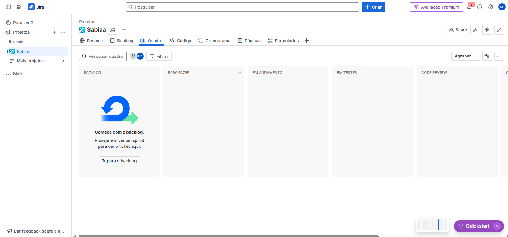


# Solução Implementada

Esta seção apresenta todos os detalhes da solução criada no projeto.

## Vídeo do Projeto

O vídeo a seguir traz uma apresentação do problema que a equipe está tratando e a proposta de solução. ⚠️ EXEMPLO ⚠️

[](https://www.youtube.com/embed/70gGoFyGeqQ)

> ⚠️ **APAGUE ESSA PARTE ANTES DE ENTREGAR SEU TRABALHO**
>
> O video de apresentação é voltado para que o público externo possa conhecer a solução. O formato é livre, sendo importante que seja apresentado o problema e a solução numa linguagem descomplicada e direta.
>
> Inclua um link para o vídeo do projeto.

## Funcionalidades

Esta seção apresenta as funcionalidades da solução.Info

##### Funcionalidade 1 - Cadastro de Contatos ⚠️ EXEMPLO ⚠️

Permite a inclusão, leitura, alteração e exclusão de contatos para o sistema

* **Estrutura de dados:** [Contatos](#ti_ed_contatos)
* **Instruções de acesso:**
  * Abra o site e efetue o login
  * Acesse o menu principal e escolha a opção Cadastros
  * Em seguida, escolha a opção Contatos
* **Tela da funcionalidade**:


> ⚠️ **APAGUE ESSA PARTE ANTES DE ENTREGAR SEU TRABALHO**
>
> Apresente cada uma das funcionalidades que a aplicação fornece tanto para os usuários quanto aos administradores da solução.
>
> Inclua, para cada funcionalidade, itens como: (1) titulos e descrição da funcionalidade; (2) Estrutura de dados associada; (3) o detalhe sobre as instruções de acesso e uso.

## Estruturas de Dados

Descrição das estruturas de dados utilizadas na solução com exemplos no formato JSON.Info

##### Estrutura de Dados - Contatos   ⚠️ EXEMPLO ⚠️

Contatos da aplicação

```json
  {
    "id": 1,
    "nome": "Leanne Graham",
    "cidade": "Belo Horizonte",
    "categoria": "amigos",
    "email": "Sincere@april.biz",
    "telefone": "1-770-736-8031",
    "website": "hildegard.org"
  }
  
```

##### Estrutura de Dados - Usuários  ⚠️ EXEMPLO ⚠️

Registro dos usuários do sistema utilizados para login e para o perfil do sistema

```json
  {
    id: "eed55b91-45be-4f2c-81bc-7686135503f9",
    email: "admin@abc.com",
    id: "eed55b91-45be-4f2c-81bc-7686135503f9",
    login: "admin",
    nome: "Administrador do Sistema",
    senha: "123"
  }
```

> ⚠️ **APAGUE ESSA PARTE ANTES DE ENTREGAR SEU TRABALHO**
>
> Apresente as estruturas de dados utilizadas na solução tanto para dados utilizados na essência da aplicação quanto outras estruturas que foram criadas para algum tipo de configuração
>
> Nomeie a estrutura, coloque uma descrição sucinta e apresente um exemplo em formato JSON.
>
> **Orientações:**
>
> * [JSON Introduction](https://www.w3schools.com/js/js_json_intro.asp)
> * [Trabalhando com JSON - Aprendendo desenvolvimento web | MDN](https://developer.mozilla.org/pt-BR/docs/Learn/JavaScript/Objects/JSON)

## Módulos e APIs

Esta seção apresenta os módulos e APIs utilizados na solução

**Images**:

* Unsplash - [https://unsplash.com/](https://unsplash.com/) ⚠️ EXEMPLO ⚠️

**Fonts:**

* Icons Font Face - [https://fontawesome.com/](https://fontawesome.com/) ⚠️ EXEMPLO ⚠️

**Scripts:**

* jQuery - [http://www.jquery.com/](http://www.jquery.com/) ⚠️ EXEMPLO ⚠️
* Bootstrap 4 - [http://getbootstrap.com/](http://getbootstrap.com/) ⚠️ EXEMPLO ⚠️

> ⚠️ **APAGUE ESSA PARTE ANTES DE ENTREGAR SEU TRABALHO**
>
> Apresente os módulos e APIs utilizados no desenvolvimento da solução. Inclua itens como: (1) Frameworks, bibliotecas, módulos, etc. utilizados no desenvolvimento da solução; (2) APIs utilizadas para acesso a dados, serviços, etc.

# Referências

As referências utilizadas no trabalho foram:

BRASIL. Lei nº 13.005, de 25 de junho de 2014. Aprova o Plano Nacional de Educação - PNE e dá outras providências. **Diário Oficial da União**, Brasília, DF, 26 jun. 2014. Disponível em: http://www.planalto.gov.br/ccivil_03/_ato2011-2014/2014/lei/l13005.htm. Acesso em: 28 set. 2025.

BRASIL. Lei nº 13.709, de 14 de agosto de 2018. Lei Geral de Proteção de Dados Pessoais (LGPD). **Diário Oficial da União**, Brasília, DF, 15 ago. 2018. Disponível em: http://www.planalto.gov.br/ccivil_03/_ato2015-2018/2018/lei/l13709.htm. Acesso em: 28 set. 2025.

BRASIL. Ministério da Educação. **Base Nacional Comum Curricular (BNCC)**. Brasília: MEC, 2018. Disponível em: http://basenacionalcomum.mec.gov.br/. Acesso em: 28 set. 2025.

CENTRO REGIONAL DE ESTUDOS PARA O DESENVOLVIMENTO DA SOCIEDADE DA INFORMAÇÃO. **Pesquisa sobre o uso das tecnologias de informação e comunicação nos domicílios brasileiros: TIC Domicílios 2022**. São Paulo: Comitê Gestor da Internet no Brasil, 2023. Disponível em: https://www.cetic.br/pt/pesquisa/domicilios/. Acesso em: 28 set. 2025.

INSTITUTO BRASILEIRO DE GEOGRAFIA E ESTATÍSTICA. **Pesquisa Nacional por Amostra de Domicílios Contínua - Tecnologia da Informação e Comunicação (PNAD Contínua TIC) 2022**. Rio de Janeiro: IBGE, 2023. Disponível em: https://www.ibge.gov.br/estatisticas/sociais/habitacao/17270-pnad-continua.html. Acesso em: 28 set. 2025.

INSTITUTO NACIONAL DE ESTUDOS E PESQUISAS EDUCACIONAIS ANÍSIO TEIXEIRA. **Censo Escolar da Educação Básica 2023**. Brasília: INEP, 2024. Disponível em: https://www.gov.br/inep/pt-br/areas-de-atuacao/pesquisas-estatisticas-e-indicadores/censo-escolar. Acesso em: 28 set. 2025.

INSTITUTO NACIONAL DE ESTUDOS E PESQUISAS EDUCACIONAIS ANÍSIO TEIXEIRA. **Sistema de Avaliação da Educação Básica (SAEB) 2021: principais resultados**. Brasília: INEP, 2022. Disponível em: https://download.inep.gov.br/educacao_basica/saeb/2021/resultados/relatorio_de_resultados_do_saeb_2021_volume_1.pdf. Acesso em: 28 set. 2025.

OBSERVATÓRIO DO PLANO NACIONAL DE EDUCAÇÃO. **Indicadores e metas do PNE**. Brasília: Observatório do PNE, 2024. Disponível em: https://www.gov.br/inep/pt-br/acesso-a-informacao/dados-abertos/inep-data/painel-de-monitoramento-do-pne. Acesso em: 28 set. 2025.

ORGANIZAÇÃO DAS NAÇÕES UNIDAS PARA A EDUCAÇÃO, A CIÊNCIA E A CULTURA. **Relatório de Monitoramento Global da Educação 2020: inclusão e educação para todos**. Paris: UNESCO, 2020. Disponível em: https://gem-report-2020.unesco.org/. Acesso em: 28 set. 2025.

UNESCO BRASIL. **Educação no Brasil**. Brasília: UNESCO, 2024. Disponível em: https://pt.unesco.org/fieldoffice/brasilia. Acesso em: 28 set. 2025.
